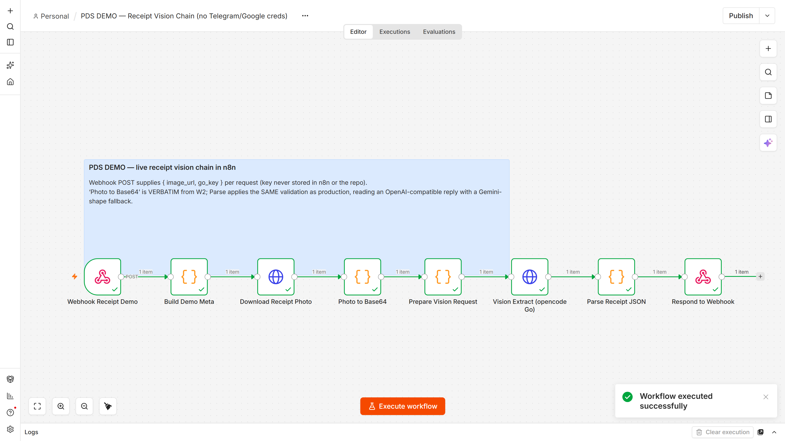
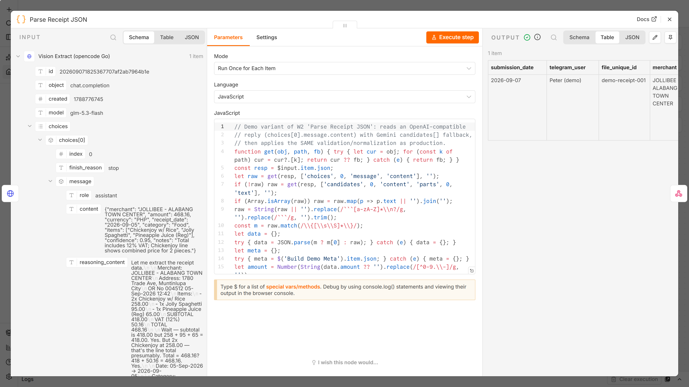

# Receipt Processing & Email Operations Automation

Two n8n workflows built for the Precision Data Solutions assessment, turning
incoming emails and receipt photos into structured records and organized files.

**What to inspect:** [recorded receipt vision-chain demo](docs/images/demo_run.mp4),
[test report](docs/TEST_REPORT.md), and [importable workflows](workflows/).

The implementation handles duplicate inputs, repeat writes, invalid extracted data,
and branch-level failures through stable keys, idempotent upserts, validation,
and explicit error reporting. JavaScript tests exercise the workflow Code nodes.

**Scope:** this is an assessment implementation. The recording verifies the receipt
vision chain through a webhook harness; it does not establish a full production
Telegram/Google deployment, extraction accuracy rate, or throughput benchmark.

## Workflows

- **Workflow 1 — Multi-Label Gmail to Google Sheets & Drive.** Polls a Gmail
  inbox on a schedule for incoming mail under multiple labels, logs sender
  details to a Google Sheet, and saves attachments to Drive with their
  original filenames, grouped in folders by label / date received / sender
  (33 nodes).
- **Workflow 2 — Telegram Receipt Photo Processing.** Accepts receipt photos
  via a Telegram bot, extracts merchant / amount / date (and more) with a
  vision model, logs them to a Google Sheet, and saves the original photo
  to Drive grouped by submission date (27 nodes).

Both JSONs import cleanly into **n8n 2.37.10** and follow the same engineering
standard: Config node for all IDs/thresholds, dedupe on stable keys, idempotent
upserts, per-branch failure replies, and an Errors-tab logger — zero secrets in
the workflow files.

## Watch it run

A real execution inside n8n 2.37.10 (Docker), recorded end-to-end — webhook in,
photo downloaded, vision extraction, validated record out in **11.2 s**:

https://github.com/pihuts/pds-n8n-portfolio/raw/main/docs/images/demo_run.mp4



The demo harness (`demo/demo_receipt_vision_chain.json`) mirrors W2's hot path
with a webhook instead of the Telegram trigger — **`Photo to Base64` is the
verbatim W2 code** and the parser applies W2's exact validation. What the run
produced from a real receipt photo:

| field | value |
|---|---|
| merchant | JOLLIBEE - ALABANG TOWN CENTER |
| amount | 468.16 PHP |
| receipt_date | 2026-09-07 |
| category | Food |
| items | Chickenjoy w/ Rice; Jolly Spaghetti; Pineapple Juice (Reg) |
| confidence | 0.95 |
| needs_review | false |



More evidence: [executions tab](docs/images/demo_executions.png) (Succeeded in
10.99s), [raw model reply + prompt](docs/images/demo_ndv_vision.png),
[W1 canvas](docs/images/w1_canvas.png), [W2 canvas](docs/images/w2_canvas.png),
and the full write-up in
[docs/TEST_REPORT.md → "In-engine verification"](docs/TEST_REPORT.md).

## Repository layout

```
workflows/
  workflow1_gmail_multi_label_to_sheets_drive.json   W1: Gmail -> Sheets + Drive
  workflow2_telegram_receipt_gemini.json             W2: Telegram -> vision -> Sheets + Drive
demo/
  demo_receipt_vision_chain.json  in-engine demo of W2's vision chain (webhook-triggered)
docs/
  SETUP.md            step-by-step: credentials, IDs, sheet tabs, activation
  SHEETS_SCHEMA.md    exact tab + header layouts to create
  ARCHITECTURE.md     design decisions, data flow, idempotency, failure handling
  TEST_REPORT.md      what was tested, how, results, known limits + in-engine run
  SUBMISSION_EMAIL.md ready-to-send reply for the HR thread
  SUBMISSION_EMAIL.txt short plain-text version of the same reply
  images/             screenshots + demo_run.mp4 (live execution recording)
config/
  .env.example        template for the single secret (vision API key, added as an
                      n8n Header-Auth credential - never stored in the workflows)
tests/
  test_workflows.js   structural validation of both workflow JSONs
  test_code_nodes.js  unit tests executing the real Code-node JavaScript
  test_vision_spark.js  live vision test: feeds a model reply through the real
                      Parse code and asserts the extracted receipt (5 checks)
  fixtures/           sample receipts used in the tests
```

## Quick start

1. Read `docs/SETUP.md` (15-20 min, mostly clicking through the Google and
   Telegram consoles).
2. In n8n: **Import from File**, pick a workflow JSON, fill in its Config
   node (Sheet ID, Drive folder ID), connect the credentials, Activate.
3. Send a test email / receipt photo and watch the first execution.

To reproduce the in-engine demo: import `demo/demo_receipt_vision_chain.json`,
click **Execute workflow**, then POST
`{ "image_url": "<public URL of a receipt image>", "go_key": "<your key>" }`
to `/webhook-test/receipt-demo` — the key is read per request and never
persisted. To run W2's chain against a different vision model, only the URL,
model name, and reply shape in the demo's vision nodes need changing; W2
itself ships pointed at Google Gemini with the key in a Header-Auth credential.

## Secrets

No secrets are stored in this package. The Gemini API key is added in the
n8n UI as a Header-Auth credential (header name `x-goog-api-key`) and
selected on the Gemini node - works on n8n Cloud and self-hosted, no env
vars required. The Telegram token lives in the n8n Telegram credential. The
demo workflow likewise takes its key per request and builds the
Authorization header at runtime, so nothing sensitive lands in this repo,
the workflow JSON, or execution data.

## Tests

Run from the repo root (Node.js 18+, no extra packages needed):

```
node tests/test_workflows.js     # structural checks
node tests/test_code_nodes.js    # unit tests for the Code nodes
node tests/test_vision_spark.js <model-reply-file>   # live vision chain
```

## License

Provided as assessment evidence for Precision Data Solutions.
